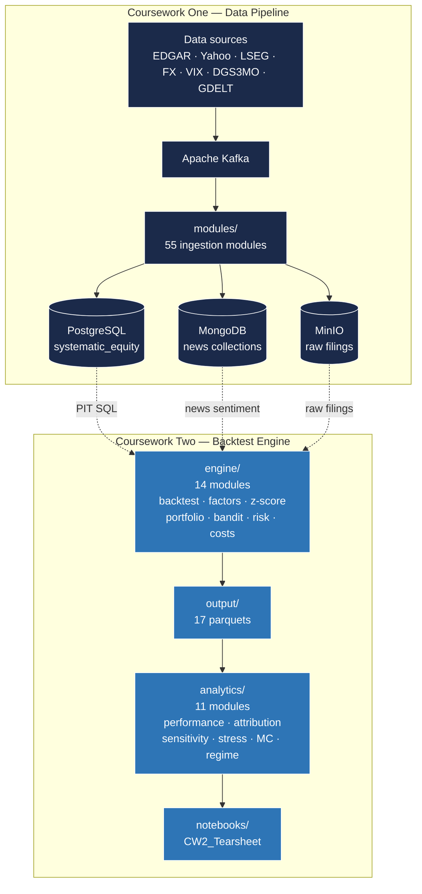

<div align="center">

# Big Data in Quantitative Finance — Team Kolmogorov

### IFTE0003 · UCL MSc Banking and Digital Finance · 2025 / 2026

*Eight-member team submission spanning a production-grade ETL pipeline (Coursework One) and a multi-factor long/short equity backtest engine (Coursework Two), built end-to-end on the same 678-stock investable universe.*

<br>

[](https://www.python.org/)
[](https://python-poetry.org/)
[](https://www.postgresql.org/)
[](https://www.mongodb.com/)
[](https://min.io/)
[](https://kafka.apache.org/)
[](https://docs.docker.com/compose/)
[](LICENSE)

<br>

**[Coursework One →](coursework_one/)** &nbsp;·&nbsp; **[Coursework Two →](coursework_two/)** &nbsp;·&nbsp; **[Team](#team)** &nbsp;·&nbsp; **[Repository Layout](#repository-layout)**

</div>

<br>

---

## Overview

| Coursework | Deliverable | Submitted |
|---|---|---|
| [**Coursework One**](coursework_one/) — Data Pipeline | Production-grade ETL ingesting 11 data streams across PostgreSQL + MongoDB + MinIO, orchestrated through Apache Kafka, for 678 listed equities across US, UK, Europe, Canada, and Switzerland. | 27 February 2026 |
| [**Coursework Two**](coursework_two/) — Investment Strategy | Monthly-rebalanced sector-neutral, dollar-neutral long/short equity backtest engine on the CW1 universe.  Two-factor composite (momentum + value) with regime overlay, three-layer risk stack, and full statistical inference. | 1 May 2026 |

Each coursework folder is a self-contained Poetry project with its own
`pyproject.toml`, `README.md`, `CHANGELOG.md`, test suite, and Sphinx
documentation.

<br>

---

## Repository Layout

```
.
├── README.md                         this file
├── CHANGELOG.md                      parent — team roster, per-folder description
├── LICENSE                           MIT
│
├── coursework_one/                   ─ Data Pipeline (CW1) ────────────
│   ├── README.md                     CW1 architecture + quick start
│   ├── CHANGELOG.md
│   ├── Main.py                       CW1 entry point
│   ├── pyproject.toml + poetry.lock  ift-systematic-equity Poetry project
│   ├── docker-compose.yml            Postgres 5439 + Mongo + MinIO + Kafka
│   ├── modules/                      55 source files (input / processing / db_ops / output / orchestration / utils / data_models)
│   ├── test/                         CW1 unit + integration tests
│   ├── config/conf.yaml              ingestion configuration
│   ├── docs/                         Sphinx source
│   ├── reports/                      data-quality reports
│   └── static/                       reference assets
│
└── coursework_two/                   ─ Investment Strategy (CW2) ──────
    ├── README.md                     CW2 quick start (Path A / B / C)
    ├── CHANGELOG.md, PLAN.md
    ├── Main.py                       CW2 entry point (engine modes)
    ├── pyproject.toml + poetry.lock  ift-coursework-two Poetry project
    ├── engine/                       14 modules — backtest, factors, z-score, portfolio, bandit, risk scaler, costs
    ├── analytics/                    11 modules — performance, attribution, sensitivity, stress, monte_carlo, regime
    ├── analysis/                     L/S inference, FF5+Mom attribution, cost-stress diagnostics
    ├── notebooks/                    CW2_Tearsheet.ipynb (executed) + CW2_Tearsheet.html
    ├── output/                       17 parquet artefacts (returns, weights, factor_*, regime_log, exposure_log, ledger)
    ├── docs/                         Sphinx source + pre-built HTML site
    ├── test/                         87 unit tests
    ├── reports/                      CW1 ↔ CW2 integration report
    └── config/                       backtest config + risk parameters
```

<br>

---

## Coursework One — Data Pipeline

<table>
<tr>
<td width="33%" align="center">
<strong>11 Data Streams</strong><br>
prices · fundamentals · ratios<br>
FX · VIX · RFR · benchmarks<br>
ESG · sentiment · static · news
</td>
<td width="33%" align="center">
<strong>Triple Database</strong><br>
PostgreSQL <code>systematic_equity</code> schema<br>
MongoDB news collections<br>
MinIO buckets for raw filings
</td>
<td width="33%" align="center">
<strong>Apache Kafka</strong><br>
event streaming for<br>
incremental ingestion +<br>
orchestrated reload windows
</td>
</tr>
</table>

The CW1 pipeline produces the data substrate that CW2 consumes directly —
no data is duplicated.  See [`coursework_one/README.md`](coursework_one/README.md)
for the full architecture, schema, and run instructions.

<details>
<summary><b>Quick start</b></summary>

```bash
cd coursework_one
docker compose up -d --build       # PostgreSQL 5439 + MongoDB + MinIO + Kafka
poetry install
poetry run python Main.py          # full ingestion run
```

</details>

<br>

---

## Coursework Two — Investment Strategy

A monthly-rebalanced sector-neutral, dollar-neutral long/short equity strategy
on the 678-stock CW1 universe.  The implemented composite combines two factors —
**momentum (12-1)** and **value (B/P + E/P + CF/P)** — at equal **50 / 50**
weights, after CW1's four-factor proposal was reduced based on out-of-sample
information-coefficient evidence.

### Headline out-of-sample performance

Window: **July 2023 → February 2026** (32 monthly observations · net of 20 bp / side).

| Variant | Ann. return | Volatility | Raw Sharpe | Excess Sharpe | Max drawdown |
|---|---:|---:|---:|---:|---:|
| **Static**  Net 20 bp | **+17.83 %** | 11.39 % | **+1.505** | **+1.087** | −7.86 % |
| **Dynamic** Net 20 bp | **+16.92 %** | 11.67 % | **+1.404** | **+0.997** | −8.64 % |
| HRP    Net 20 bp |  +7.02 % |  4.33 % | +1.592 | +0.493 | −2.67 % |
| Bandit Net 20 bp |  +9.69 % | 12.14 % | +0.824 | +0.432 | −10.17 % |

**Fama-French 5 + Carhart momentum α** (Newey-West HAC, lag 4):

| Variant | Annualised α | t-stat | p-value |
|---|---:|---:|---:|
| Dynamic Net 20 bp | **+23.97 %** | +2.353 | 0.019 ⭐ |
| Static  Net 20 bp | **+25.33 %** | +2.563 | 0.010 ⭐ |

⭐ Significant at the 5 % level — strategy α is not explained by market, size,
value, profitability, investment, or momentum exposures.

### Methodological highlights

<table>
<tr>
<td width="50%">
<strong>Portfolio construction</strong><br>
• Score-weighted allocation (Grinold-Kahn 2000)<br>
• 5 % per-stock iterative weight cap<br>
• Decile selection (top / bottom 10 %)<br>
• Sector-neutral z-scores + Gram-Schmidt<br>
• Four variants: Dynamic / Static / Bandit / HRP
</td>
<td width="50%">
<strong>Risk management — three sequential layers</strong><br>
• 99 % Historical VaR scaler (Jorion 2007)<br>
• Conditional vol-target 10 % (Moreira-Muir 2017)<br>
• Drawdown control (Korn-Korn-Kroisandt 2017)<br>
&nbsp;&nbsp;&nbsp;&nbsp;75 % at 3 % DD, 50 % at 6 % DD
</td>
</tr>
<tr>
<td width="50%">
<strong>Statistical inference</strong><br>
• Politis-Romano (1994) circular block bootstrap<br>
• Probabilistic Sharpe Ratio<br>
• Deflated Sharpe Ratio (Bailey-LdP 2014)<br>
• Minimum Backtest Length (BBLPZ 2017)<br>
• 10 ⁴ permutation test on Sharpe gap
</td>
<td width="50%">
<strong>Robustness</strong><br>
• Combinatorial Purged CV grid (15 × 66 folds)<br>
• 8-variant factor ablation<br>
• 4-cost stress matrix (10 / 20 / 50 / 100 bp)<br>
• 3-regime VIX-conditional decomposition<br>
• 10 ⁴ block-bootstrap NAV path simulation
</td>
</tr>
</table>

See [`coursework_two/README.md`](coursework_two/README.md) for the three run paths,
the data contract (17 parquet artefacts), reproducibility seal, and troubleshooting.

<details>
<summary><b>Quick start</b></summary>

Three paths depending on starting state:

```bash
cd coursework_two

# Path A — full setup from scratch (Docker + Poetry + DB pre-flight)
docker compose -f ../coursework_one/docker-compose.yml up -d --build
poetry install
poetry run python -m ipykernel install --user --name=cw2-poetry --display-name="CW2 (poetry venv)"

# Path B — full pipeline (CW1 DB up, ~ 40 min)
poetry run python Main.py --mode full --start 2023-07-01 --end 2026-03-31
poetry run python Main.py --mode sensitivity --start 2023-07-01 --end 2026-03-31
poetry run python Main.py --mode ablation    --start 2023-07-01 --end 2026-03-31
poetry run python Main.py --mode stress
poetry run python Main.py --mode monte_carlo
poetry run python Main.py --mode regime_perf
poetry run python analysis/run_attribution_ls.py
poetry run python analysis/run_inference_ls.py
poetry run python analysis/run_cost_stress_ls_v2.py
poetry run python -m jupyter nbconvert --to notebook --execute \
    notebooks/CW2_Tearsheet.ipynb --inplace \
    --ExecutePreprocessor.kernel_name=cw2-poetry

# Path C — tearsheet only (no DB required, ~ 3 min)
# Re-renders the committed notebook against the committed parquets.
poetry run python -m jupyter nbconvert --to notebook --execute \
    notebooks/CW2_Tearsheet.ipynb --inplace \
    --ExecutePreprocessor.kernel_name=cw2-poetry
```

</details>

<br>

---

## Architecture



<br>

---

## Tech Stack

<table>
<tr>
<td width="50%" valign="top">

**Languages & runtimes**
- Python 3.10 – 3.13 (Poetry-managed venvs)
- SQL (PostgreSQL 16, ANSI + window functions)
- Mermaid + RST + Markdown for documentation

**Data + storage**
- PostgreSQL 16 — structured time series
- MongoDB 7 — semi-structured news
- MinIO — object storage for raw filings
- Apache Kafka 3.0 — event streaming

</td>
<td width="50%" valign="top">

**Quant libraries**
- NumPy 2 · pandas 2.3 · SciPy 1.17
- statsmodels 0.14 (Newey-West HAC OLS)
- scikit-learn 1.4 (HRP clustering)
- pyarrow 18 (parquet I/O)
- pandas-market-calendars (NYSE)

**Tooling**
- pytest + pytest-cov
- Sphinx + napoleon + autodoc
- black / isort / flake8 / bandit
- Jupyter + nbconvert + plotly

</td>
</tr>
</table>

<br>

---

## Team

| Name | Student # | Final role |
|---|:---:|---|
| **Ryan Lin** | 24038712 | Investment Product Owner — Group Leader |
| **Ayudhya Vidyaningtyas** | 25143187 | Investment Product Owner |
| **Jianyang Zuo** (Jacob) | 25088271 | Investment Product Owner |
| **Tamer Atesyakar** | 22167510 | Developer (Lead) |
| **Tsz Fung Huang** (Lucian) | 25122340 | Developer (Auditor) |
| **Peixi Xiong** (Bessie) | 25138149 | Investment Specialist |
| **Moyan Yu** | 25094276 | Investment Specialist |
| **Xinyan Chen** (Christy) | 22033931 | Investment Specialist |

Per-member contributions are documented in Appendix B of the CW2 report.

<br>

---

## Key references

Vayanos & Woolley (2013) · Fama & French (2015) · Carhart (1997) · Asness,
Frazzini & Pedersen (2019) · Ledoit & Wolf (2004) · López de Prado (2016, 2018,
2020) · Bailey & López de Prado (2014) · Bailey, Borwein, López de Prado & Zhu
(2017) · Moreira & Muir (2017) · Korn, Korn & Kroisandt (2017) · Agrawal &
Goyal (2013) · Politis & Romano (1994) · Newey & West (1987) · Andrews (1991)
· Jorion (2007) · Daniel & Moskowitz (2016) · Grinold & Kahn (2000) · Jegadeesh
& Titman (1993).

Full bibliography in the CW2 report and [`coursework_two/PLAN.md`](coursework_two/PLAN.md).

<br>

---

<div align="center">

**MIT License** · See [LICENSE](LICENSE)

*University College London · MSc Banking and Digital Finance · IFTE0003 · 2025 / 2026*

</div>
